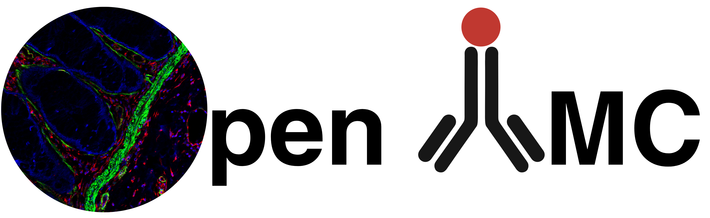

# OpenIMC



OpenIMC is a comprehensive, open-source PyQt5-based platform for analyzing Imaging Mass Cytometry (IMC) data. It provides an intuitive graphical interface for visualizing, processing, and analyzing multi-channel imaging data from mass cytometry experiments with advanced machine learning capabilities.

## Documentation

For complete documentation, installation instructions, and usage guides, please visit:

**https://dean-tessone.github.io/OpenIMC/overview.html**

## Quick Start

### Installation

The most common installation pattern:

```bash
# Clone the repository
git clone https://github.com/dean-tessone/OpenIMC.git
cd OpenIMC

# Create conda environment
conda create -n openimc python=3.11
conda activate openimc

# Install dependencies
pip install -r requirements.txt

# Install the package
pip install .
```

For detailed installation instructions, including alternative methods and troubleshooting, see the [Installation documentation](https://dean-tessone.github.io/OpenIMC/installation.html).

### Running OpenIMC

After installation, you can run:

```bash
# Start the GUI application
openimc-gui

# Or run the CLI
openimc --help
```

## License

OpenIMC – Interactive analysis toolkit for IMC data

Copyright (C) 2025 University of Southern California

This program is free software: you can redistribute it and/or modify it under the terms of the GNU General Public License as published by the Free Software Foundation, either version 3 of the License, or (at your option) any later version.

This program is distributed in the hope that it will be useful, but WITHOUT ANY WARRANTY; without even the implied warranty of MERCHANTABILITY or FITNESS FOR A PARTICULAR PURPOSE. See the GNU General Public License for more details.

You should have received a copy of the GNU General Public License along with this program (see LICENSE). If not, see <https://www.gnu.org/licenses/>.
